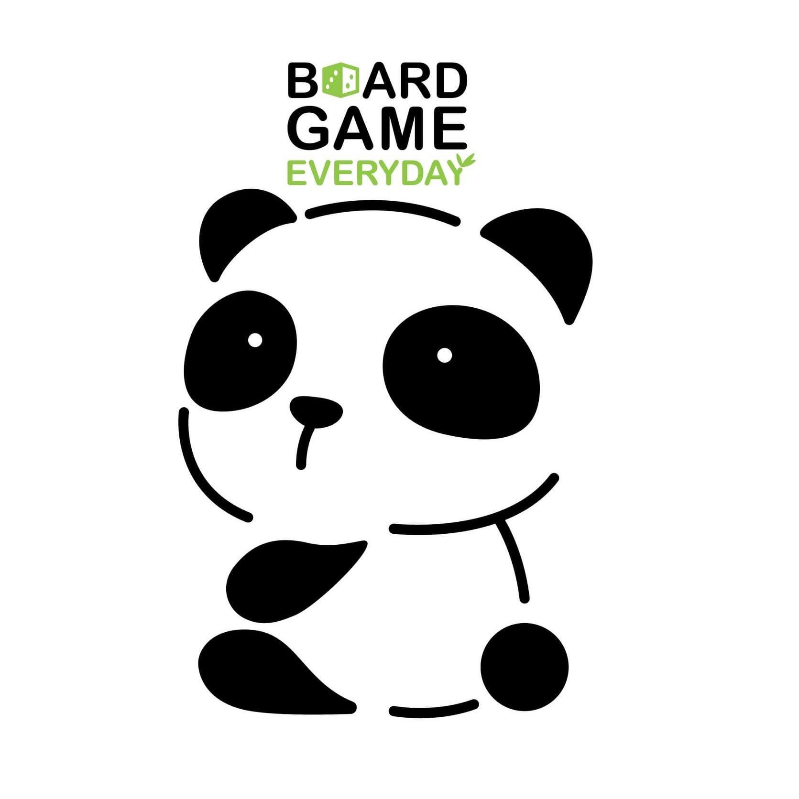

# BoardGame project



## There are 3 project

1. Web BoardGame is named frontend.
2. Api project is Api.
3. Web Admin is webadmin.

## To run project

## docker-compose.yml file


### Build and Execute project  

- For build project and override <span style="color:lightgreen">*docker-compose.yml*</span>.

```html
docker compose -f docker-compose.yml -f <docker-compose.dev | docker-compose.prod>.yml build
```

- For execute project and override <span style="color:lightgreen">*docker-compose.yml*</span>.

```html
docker compose -f docker-compose.yml -f <docker-compose.dev | docker-compose.prod>.yaml up 
```

### Execute with Load balancer

- For execute project with load balancer

```html
docker compose -f <docker-compose.yml> -f <docker-compose.prod.yaml> up --scale <container_name>=<number_of_scaling (e.g. =3)> -d --build 
```
